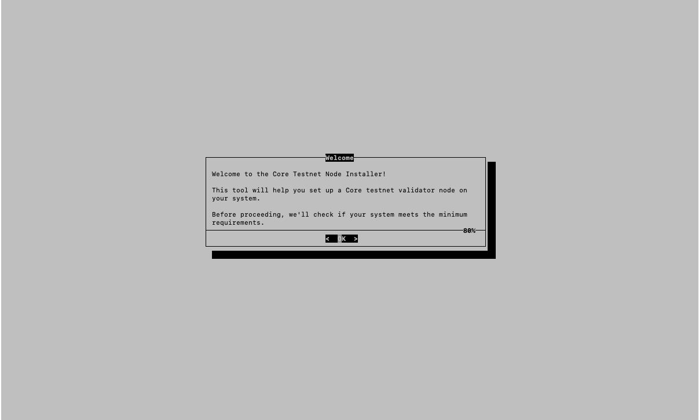
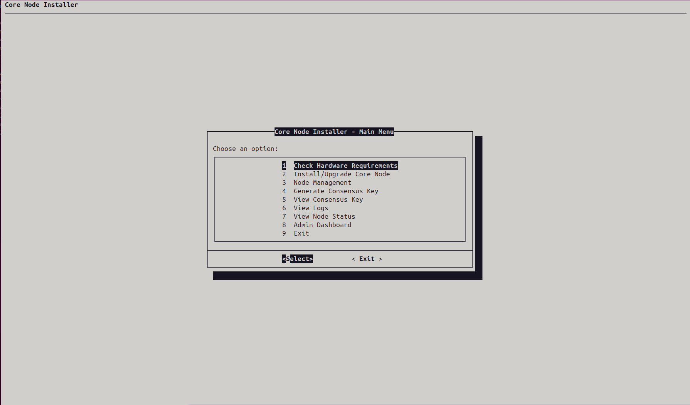
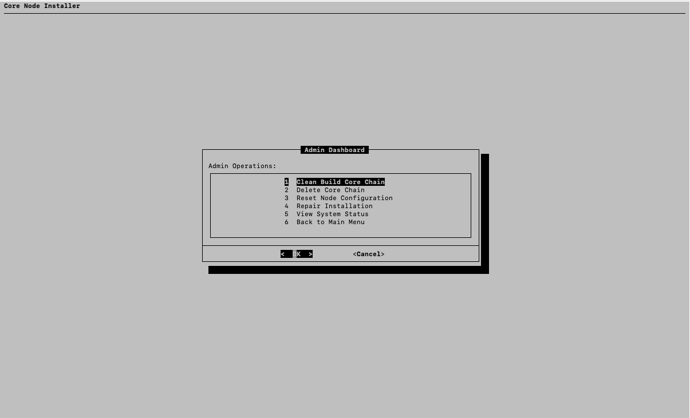

# Core Node Installer: TUI for Testnet Validator Setup


A robust Terminal User Interface (TUI) for setting up and managing Core testnet validator nodes. This installer provides an intuitive, dialog-based interface that simplifies the entire process from initial setup to ongoing maintenance.



## Key Features

### 1. Installation & Setup
- **Automated Hardware Verification**
  - CPU cores check (minimum 4 cores)
  - RAM verification (minimum 8GB)
  - Storage space validation (minimum 1TB)
  - Network speed test (minimum 10 Mbps)
  - Real-time system requirements display

- **Smart Dependency Management**
  - Auto-detection of missing dependencies
  - Automated installation of required packages
  - Support for multiple package managers (apt, yum, brew)
  - Go version management and installation

- **Robust Download System**
  - Real-time progress display with percentage and speed
  - Automatic retry mechanism (up to 3 attempts)
  - Integrity verification of downloaded files
  - Support for large file downloads with progress tracking
  - Graceful handling of network interruptions

### 2. Node Management
- **Validator Setup**
  - Automated consensus key generation
  - Secure password management
  - Keystore file handling and verification
  - Clear display of validator addresses

- **Node Operations**
  - Start/stop node with status monitoring
  - Support for validator and non-validator modes
  - Automatic port conflict detection and resolution
  - Genesis initialization with error recovery
  - Snapshot synchronization support

### 3. Log Monitoring System
- **Real-time Log Viewing**
  - Live updates every 2 seconds
  - Color-coded output for different log levels
  - Automatic scroll with newest entries
  - Search functionality within logs

- **Log Management**
  - Log rotation and archiving
  - Export capabilities with timestamps
  - Log statistics and analysis
  - Error tracking and reporting

### 4. Error Handling & Recovery
- **Intelligent Error Detection**
  - Database consistency checks
  - Chain gap detection and resolution
  - Automatic recovery suggestions
  - Guided error resolution

- **Recovery Options**
  - Database reset capabilities
  - Snapshot-based recovery
  - Configuration reset options
  - Backup and restore functionality

### 5. Admin Dashboard

- **System Maintenance**
  - Clean build functionality
  - Chain deletion with safety checks
  - Configuration management
  - Permission repair tools

- **System Monitoring**
  - Resource usage tracking
  - Chain sync status
  - Node health monitoring
  - Performance metrics

## Installation

1. Clone the repository:
   ```bash
   git clone https://github.com/harystyleseze/core-testnet-validator-node-installer.git
   cd core-testnet-validator-node-installer/core-node-installer
   ```

2. Run the installer:
   ```bash
   ./install.sh
   ```

## Usage Guide

### Initial Setup

1. **Hardware Check**
   ```
   Main Menu → Check Hardware Requirements
   ```
   - Verifies system compatibility
   - Displays detailed hardware information
   - Provides recommendations if requirements aren't met

2. **Node Installation**
   ```
   Main Menu → Install Core Node
   ```
   - Guides through dependency installation
   - Handles repository cloning and building
   - Sets up node directory structure

3. **Validator Setup**
   ```
   Main Menu → Node Management → Generate Consensus Key
   ```
   - Creates and secures validator keys
   - Manages passwords and keystores
   - Displays validator address information

### Node Management

1. **Starting the Node**
   ```
   Node Management → Start Node
   ```
   - Regular mode: `Start Node`
   - Validator mode: `Start Node as Validator`

2. **Monitoring**
   ```
   Node Management → View Node Status
   ```
   - Shows sync status
   - Displays validator information
   - Monitors performance metrics

3. **Log Viewing**
   ```
   Node Management → View Logs
   ```
   - Real-time log updates
   - Error highlighting
   - Search functionality

### Advanced Features

1. **Snapshot Management**
   - Download with progress tracking
   - Integrity verification
   - Automatic retry on failure
   - Size verification and validation

2. **Database Recovery**
   - Handles chain gaps
   - Provides recovery options
   - Maintains data integrity
   - Guided recovery process

3. **Configuration Management**
   - Template-based configuration
   - Automatic backup creation
   - Reset capabilities
   - Validation checks

## Troubleshooting

### Common Issues

1. **Download Failures**
   - System automatically retries downloads
   - Provides detailed error information
   - Offers manual retry options
   - Verifies file integrity

2. **Database Errors**
   - Detects chain gaps
   - Offers reset or snapshot options
   - Guides through recovery process
   - Preserves existing data when possible

3. **Node Startup Issues**
   - Checks for port conflicts
   - Verifies keystore accessibility
   - Validates configurations
   - Provides detailed error messages

## Contributing

We welcome contributions! Please follow these steps:

1. Fork the repository
2. Create a feature branch
3. Commit your changes
4. Push to the branch
5. Create a Pull Request

## License

This project is licensed under the MIT License.

## Support

For issues and feature requests, please use the GitHub issue tracker.
