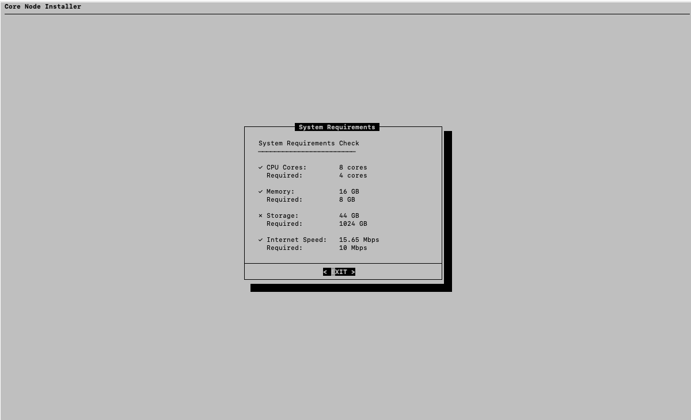

# Core Node Installer: TUI for Testnet Validator Setup


This project provides a Terminal User Interface (TUI) to guide users through the process of setting up a Core testnet validator node. The installer simplifies the entire setup process, including hardware checks, dependencies installation, node setup, and management.

## Features

- **Beautiful dialog-based user interface**: The installer provides an intuitive TUI with a menu system for easy navigation.
- **Hardware requirements verification**: Automatically checks your system's hardware to ensure it meets the requirements for running a validator node.
- **Step-by-step installation process**: Walks users through each step, from system requirements to node setup.
- **Installation logging**: Keeps logs of the installation process for troubleshooting.
- **Node management**: Allows starting and stopping the validator node through the TUI.
- **Progress indicators and status messages**: Real-time feedback during installation and node management.
- **Log Monitoring Dashboard**: A comprehensive log monitoring system for real-time log viewing, error tracking, and log management.
- **Admin Dashboard**: A new feature that provides powerful maintenance and management tools for the validator node.

## Main Components

- `install.sh`: The entry point of the installation process, which presents a dialog-based menu to the user.
- `utils.sh`: Contains utility functions used throughout the setup process.
- `hardware_check.sh`: Verifies that the system meets the hardware requirements for running a Core validator node.
- `node_setup.sh`: Contains the logic for installing and setting up the node.
- `log_monitor.sh`: The module for monitoring and managing logs, including the live log viewing dashboard and log statistics.

## Installation Process

The installation process involves several key steps to set up the validator node:

1. **System requirements check**: Ensures that your system has the required hardware and software.



2. **Dependencies installation**: Installs necessary dependencies and libraries.

3. **Repository cloning**: Clones the necessary repository for the Core node.

4. **Geth building**: Builds Geth (Go Ethereum) for the node.

5. **Node directory setup**: Creates the necessary directories for the node.

6. **Blockchain snapshot download**: Downloads the blockchain snapshot to speed up synchronization.

7. **Genesis block initialization**: Initializes the genesis block to begin the node's setup.

8. **Startup script creation**: Generates scripts to easily start and manage the node.

## Log Monitoring Dashboard

A powerful log monitoring dashboard has been added to help users track node health, troubleshoot issues, and maintain logs. The dashboard is designed for real-time monitoring and enhanced log management.

### Features

- **Live Log Viewing**:
  - Real-time log updates every 2 seconds.
  - Color-coded output (red for errors/warnings, green for info/success).
  - Scrollable window showing the last 20 log lines.
- **Log Statistics**:

  - Displays total number of log lines.
  - Provides count of errors, warnings, and info messages.
  - Shows the last error message.
  - Recent activity summary of node operation.

- **Search Functionality**:

  - Search through logs with case-insensitive matching.
  - Display search results in a scrollable window.
  - "No results found" message when no matches are found.

- **Log Management**:

  - Export logs to a timestamped file for backup or analysis.
  - Clear logs with automatic backup for historical record.
  - View both Core node logs and installation logs.

- **User Interface**:
  - Clean and intuitive menu system for easy navigation between different log views.
  - Error handling for missing log files to ensure smooth usage.

### How to Use the Log Monitoring Dashboard

1. **From the main menu**, select "Log Monitoring Dashboard".
2. **Choose between**:
   - **Core Node Logs**: View logs from the running node.
   - **Installation Logs**: View the installer’s activity log.

In the log dashboard, you can:

- **View live logs** with automatic updates every 2 seconds.
- **Check log statistics** to get error counts and activity summaries.
- **Search through logs** for specific terms or messages.
- **Export logs** for analysis or backup (timestamped files).
- **Clear logs** (with automatic backup) to free up space while maintaining history.

This log monitoring dashboard provides much more sophisticated monitoring compared to traditional methods (like `tail -f`). It's especially useful for:

- **Monitoring node health** in real time.
- **Troubleshooting node issues** by quickly identifying errors or warnings.
- **Tracking installation progress** through log messages.
- **Maintaining log history** for long-term monitoring and analysis.

## Admin Dashboard


The **Admin Dashboard** is a powerful new feature designed for advanced node management and maintenance. It provides several tools to ensure your node is running smoothly and allows you to perform essential administrative tasks.

### Features

- **Clean Build Core Chain**:

  - Cleans all build artifacts and rebuilds `geth` from scratch.
  - Displays real-time progress and confirms success or failure.
  - Ensures a fresh build of the Core chain environment.

- **Delete Core Chain**:

  - Completely removes the `core-chain` directory.
  - Requires user confirmation before proceeding.
  - Useful for starting fresh or reconfiguring the node.

- **Reset Node Configuration**:

  - Resets `config.toml` to default settings.
  - Creates a backup of the existing configuration for future restoration.
  - Ideal for fixing configuration issues or restoring default settings.

- **Repair Installation**:

  - **Verify Files**: Checks the integrity of the Git repository.
  - **Fix Permissions**: Corrects file permissions to ensure smooth operation.
  - **Reinstall Dependencies**: Reinstalls all required packages to ensure dependencies are up to date.
  - Shows progress for each operation, helping ensure everything is fixed correctly.

- **View System Status**:
  - Displays key system information including:
    - Core chain version
    - Geth version
    - Go version
    - Node status (Running/Stopped)
    - Installation directory
    - Free disk space
    - Recent log entries

### How to Use the Admin Dashboard

1. **From the main menu**, select "Admin Dashboard".
2. **Choose between**:
   - **Clean Build Core Chain**: Start a fresh rebuild of `geth` and clean the Core chain.
   - **Delete Core Chain**: Remove the `core-chain` directory completely (with confirmation).
   - **Reset Node Configuration**: Reset the node configuration to default settings.
   - **Repair Installation**: Run file verification, fix permissions, or reinstall dependencies.
   - **View System Status**: View current system status, including versions, disk space, and node health.

The Admin Dashboard ensures that node maintenance is easy and safe, with confirmation dialogs for destructive operations and real-time progress tracking. It helps administrators maintain a healthy node environment by providing powerful tools to clean, reset, and repair the node configuration and setup.

## Usage

### Prerequisites

- A Linux-based OS (Ubuntu is recommended).
- Terminal with bash support.
- Sufficient system resources as per the hardware requirements.

### Steps to Use

1. Clone the repository:

   ```bash
   git clone https://github.com/harystyleseze/core-testnet-validator-node-installer.git
   cd core-testnet-validator-node-installer/core-node-installer
   ```

2. Run the installer:

   ```bash
   ./install.sh
   ```

3. The installer will present the following options:
   - **Check Hardware Requirements**: Verify that your system meets the minimum hardware requirements.
   - **Install Core Node**: Proceed with the full installation of the Core testnet validator node.
   - **View Installation Log**: View the logs from the installation process.
   - **Start/Stop Node**: Start or stop the validator node.
   - **Log Monitoring Dashboard**: Access the live log viewing dashboard.
   - **Admin Dashboard**: Access the new Admin Dashboard for advanced node management and maintenance.
   - **Exit**: Exit the installer.

### Installation Flow

The installer will guide you through the following steps:

1. **Welcome Screen**: A friendly introduction to the installation process.
2. **Main Menu**: From here, you can choose between the available options.
3. **Step-by-Step Installation**: If you select to install the node, the installer will run a series of checks, install dependencies, and configure the node.
4. **Progress Feedback**: You'll receive real-time status updates and progress indicators as the installation progresses.
5. **Completion**: Once the installation is complete, you'll have the option to start your node immediately.

### Starting and Stopping the Node

After installation, you can manage your node by selecting the **Start/Stop Node** option from the main menu. This will allow you to control the Core testnet validator node without manually entering commands.

## Example Screenshots

The installer includes beautiful dialog-based menus and progress bars to guide users through the setup. Here's a preview:

- **Main Menu:**

  

  ```
  Welcome to Core Node Installer

  Please select an option:
  1) Check Hardware Requirements
  2) Install Core Node
  3) View Installation Log
  4) Start/Stop Node
  5) Log Monitoring Dashboard
  6) Admin Dashboard
  7) Exit
  ```

- **Log Monitoring Dashboard:**

  ```
  Log Monitoring Dashboard

  Please select a log view:
  1) Core Node Logs
  2) Installation Logs
  3) Search Logs
  4) Export Logs
  5) Clear Logs
  6) Back
  ```

- **Admin Dashboard:**

  ```
  Admin Dashboard

  Please select an option:
  1) Clean Build Core Chain
  2) Delete Core Chain
  3) Reset Node Configuration
  4) Repair Installation
  5) View System Status
  6) Back
  ```

- **Installation Progress:**
  ```
  Installing dependencies...
  [#####---------] 50% done
  ```

## Contributing

If you'd like to contribute to this project, feel free to fork the repository and submit a pull request. Issues and feature requests can be submitted through GitHub's issue tracker.

## License

This project is licensed under the MIT License

---

Thank you for using Core Node Installer. We hope this tool simplifies your testnet validator setup experience!
